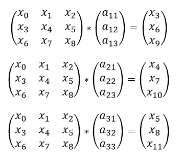
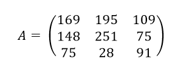

# Загадки Лихолесья

|   Cобытие   | Название | Категория | Сложность |
| :---------: | :------: | :-------: | :-------: |
| VKACTF 2022 |  Загадки Лихолесья  |  Криптография  |  Легкий  |

## Описание

>Автор: CryptoDjon
>
>Живут в Лихолесье три сестры,
>
>Питают кровью темный лес.
>
>Тот путник, что попал к ним на опушку
>
>Должен разгадать загадку,
>
>Иначе - смерть…
>
>PS. У них есть своя "бухгалтерия", расшифруешь её – узнаешь, кто жив, а кому приказано долго жить ;)
>
>P.S.2. Шифруется sqlite3

# Решение

Из анализа исходников делаем несколько выводов: 
- использовался поточный шифр для шифрования БД;
- в качестве ключа выступает матрица 3*3;
- умножение матрицы на вектор по модулю 256 - это наш генератор гаммы для поточного шифра.

Немного подумав и поискав в интернете, можно найти так называемый шифр Хилла с модулем 256, на котором и основан генератор гаммы. 

Также можно заметить, что используемая матрица должна быть обратима по модулю 256, иначе расшифровать не получится.

Для восстановления исходной матрицы необходимо 4 известных вектора состояния, для этого воспользуемся особенностью поточного шифра.

Так как, последняя операция это XOR, а у файла формата .db первые 16 байт фиксированы : 
- fix = b'SQLite format 3\x00'. 

Найдем 4 вектора состояния простым XOR(ct[:12],fix[:12]).

Далее, необходимо решить 3 матричных уравнения для восстановления каждой строки секретной матрицы, если Xi это гамма, где i = 0,...,11, а aij это элементы секретной матрицы: 



После чего секретная матрица получится: 



Далее остаётся лишь расшифровать БД.

[Решение](solve.sage)
### Флаг

Достаем из БД наш флаг
```
vka{a_stream_cipher_based_on_the_Hill_cipher_has_the_same_vulnerabilities}
```
