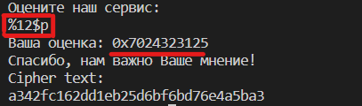
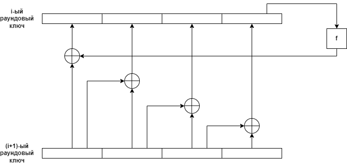

## XORовод

| Событие | Название | Категория | Сложность |
| :------ | ---- | ---- | ---- |
| VKACTF 2022 | XORовод | Криптография | Easy |

### Описание

> Автор: iC0nst
>
> Издревле на Руси любили хороводы! Вот и здесь есть один. Но вот так ли он крепок? 

>nc 176.118.164.39 44077

Имеется сервис, шифруюший флаги. Посмотрев в декомпилированный код, можно видеть, что используется AES в режиме ECB. При этом по мере шифрования на некоторых раундах пользователю предлагается ответить на вопросы, в частности на 8 раунде требуется оценить сервис. Оценка выводится на экран с помощью функции printf, на основании чего можно сделать предположение о наличии уязвимости форматной строки. Нетрудно убедиться в правильности этой мысли:

После прочтения со стека раундового ключа для восстановления главного ключа шифрования достаточно реализовать алгоритм, обратный алгоритму расширения ключа (aes_key_expansion). 

Проделав операции, показанные на рисунке, 8 раз, будет получен ключ шифрования, с помощью которого можно расшифровать флаг.

[Здесь](solve.py) можно ознакомиться с эксплойтом.