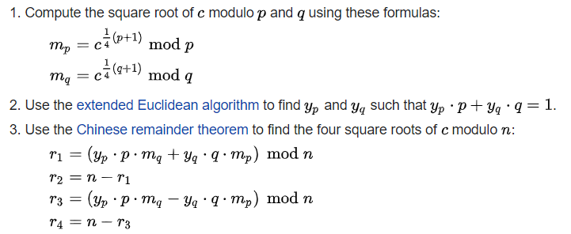
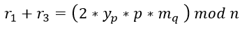
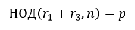

# Славная битва

|   Cобытие   | Название | Категория | Сложность |
| :---------: | :------: | :-------: | :-------: |
| VKACTF 2022 |  Славная битва  |  Криптография  |  Средний  |

## Описание

>Автор: CryptoDjon
>
>В некотором царстве, в некотором государстве жил-был царь, и была у царя дочка красавица, каких на всем белом свете не сыщешь. Был мир в тех краях пока Змей трехголовый там не завелся, и царевну не уволок в свое логово. Вызвался её Илья Муромец спасать и сошелся в битве с чудищем… 
Хорошо, что Илюша знал про слабые места ;)

>nc 176.118.164.39 1337

# Решение

Подключаемся к сервису по nc и видим, что функционал состоит всего из 2 действий:
- Получить зашифрованный пароль;
- Ввод пароля.

Из анализа исходников делаем несколько выводов: 
- Есть скрытый функционал;
- Пароль шифруется с помощью RSA, причём пароль каждый раз новый, как и параметры RSA.

Из скрытого функционала получаем хотя бы n для RSA, это уже хоть что-то. Далее можно воспользоваться калькулятором, но он не простой, а все действия выполняются по модулю!

Интерес представляет больше всего операция извлечения квадратного корня по модулю. Как известно, извлечение квадратного корня по модулю даст целых 4 корня:



Сервис возвращает один из них случайным образом.

Теперь же, если сложить 1 и 3 корень: 



получим, что: 




Как бы это ни было странно, но через НОД при любых параметрах можно найти один из множителей n.

После чего находим q, находим d, так как известно, что e = 65537. А после и сам пароль находим. Подаем его на проверку и получаем флаг.

[Решение](solve.py)

### Флаг


```
vka{An_interesting_feature_of_the_Rabin_cryptosystem!}
```