# Король и Шут

|   Cобытие   | Название | Категория | Сложность |
| :---------: | :------: | :-------: | :-------: |
| VKACTF 2022 |  Король и Шут  |  Криптография  |  Сложный  |

## Описание

>Автор: CryptoDjon
>
>Жил Король, был злой и властный,
>
>При дворе был Шут мозгастый,
>
>Веселил народ загадкой, 
>
>Квантовой-криптой и сказкой.
>
>
>
>Как-то раз его владыка 
>
>Проучить решил загадкой
>
>Вызвал он Шута к себе
>
>Да сказал ему при всех:
>
>
>
>«Человек, ты Миша, славный,
>
>Завадной, чудной, забавный,
>
>Но таких полно вокруг...
>
>
>
>Коли голову оставить
>
>При плечах своих желаешь,
>
>Подмени-ка ты, дружок,
>
>[Подпись царскую мою.](http://176.118.164.39:31337/)
>
>
>
>Если сможешь, шут придворный,
>
>Я тебя озолочу, дочь сосватаю свою,
>
>Будешь петь и танцевать,
>
>Дни счастливые сживать»

# Решение

Исследовав функционал сайта и исходный код, приходим к выводу, что для получения флага необходимо получить сертификат, в котором имя пользователя - admin и стоит True в поле admin:
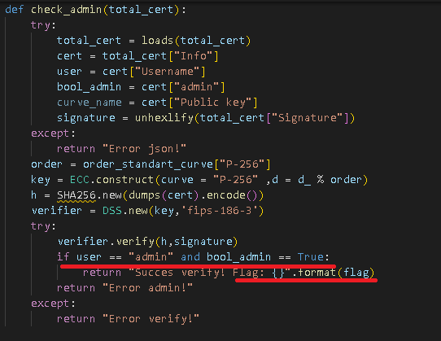

При этом, для подписи сертификата используется стандартная кривая P-256, а получить сертификат с именем admin и пометкой True сервис не позволяет, значит, необходимо исследовать функционал, отвечающий за подачу собственных параметров кривой.

Функционал чата не имеет отношения к решению, пытаться применить XSS нет смысла, пользователь admin существует, но украсть cookie его не получится.

Из исходника видно, что очень хорошо проверяется порядок ЭК, но нигде нет проверки поданной базовой точки: 

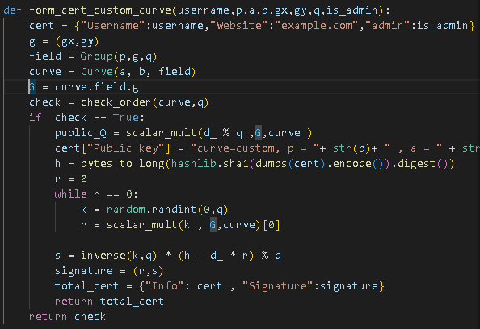

Это достаточно, чтобы увидеть, так называемую, Invalid Curve Point Attack, обычно её связывают с протоколом Диффи-Хеллмана на ЭК, но для ECDSA эта атака также пригодна.

Также указано, что общий секрет сервиса d используется для подписи с использованием любых параметров. Таким образом, атаку будем проводить по такому принципу:

1. Для начала напишем функции генерации параметров 64-битных ЭК (такой битности вполне будет достаточно) таких, что порядок проходит проверку сервиса. Пусть сгенерирована кривая:
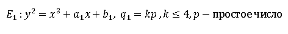

2. Разберём основу Invalid Curve attack. Из-за того,что в формулах сложения точек не участвует параметр b:
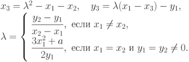
Становится возможным сложить точки, которые не относятся к одной ЭК и имеют совершенно другой порядок.
Таким образом, сгенерируем кривую, перебирая параметр b:
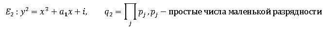

3. Подадим на вход сервису параметры кривой 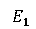 и точку G, принадлежащую кривой 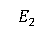.

4. Получим публичный ключ:
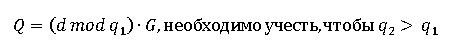
и учтём, что порядок точки G - 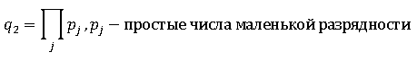
уязвим для алгоритма Полига-Хеллмана.

5. Воспользуемся алгоритмом Полига-Хеллмана и найдём:
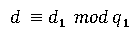

6. Возвращаемся к шагу 1 и повторяем его раз 7, чтобы произведение получившихся порядков было больше 384-битного модуля кривой P-384.

7. Имеем итоговую систему сравнений:
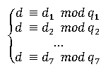
Воспользуемся китайской теоремой об остатках и восстановим общий секрет d.

8. Воспользуемся функцией генерации сертификатов и сгенерируем новый сертификат для получения флага.

Решение реализовано на [Sage9.2](exploit/sploit.sage) и на [Python](exploit/sploit_end_block.py). Это было сделано так из-за того, что Sage9.2 может не принять хэш-функцию SHA256 из библиотеки Crypto.

### Флаг

```
vka{ohhh_noooo!_invalid_curve_attack_on_ECDSA}
```