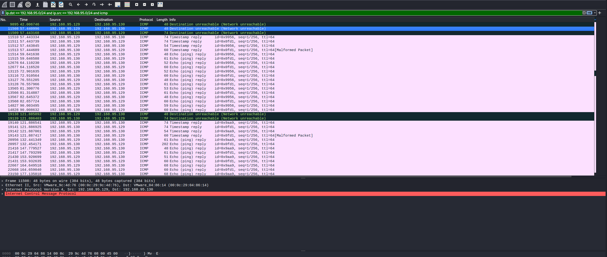
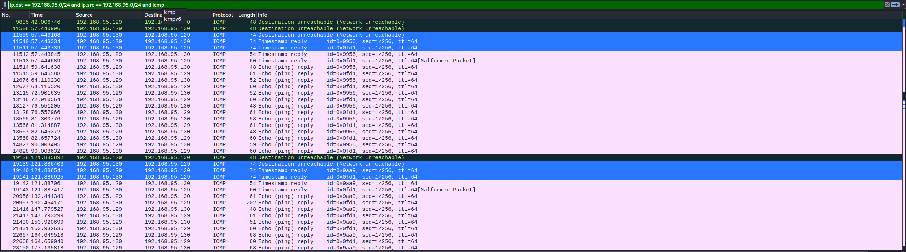

# New PRNG

|   Cобытие   | Название | Категория | Сложность |
| :---------: | :------: | :-------: | :-------: |
| VKACTF 2022 |  Кибер-коммивояжер  |  Форензика  |  hard  |

## Описание

>Автор: WaffeSoul
>
>"Даже в нашем дивном царстве, даже в нашем государстве имеется киберпреступность. Наши диджитал-богатыри заметили подозрительную персону в сетке Киберграда, ну и обратились за помощью к дядьке Black'o'hat'у. Он мужик толковый: на след. сутки дал наводку и дамп трафика. В наводке говорится, что никнейм этого паренька UnXORable. Проблема в том, что все наши кибербойцы сейчас заняты Шифрогидрой, которая стоит прям у файрвола, поэтому нам нужна твоя помощь. Разберись, что там происходит"

# Решение

Анализируя дам трафика определяем, что дамп трафика снят с 192.168.95.129. Ip локальный скорее всего следует искать ip из этой подсети. Используем фильтр в wireshark:
    
    ip.dst == 192.168.95.0/24 and ip.src == 192.168.95.0/24

Находим, еще два ip: 

    192.168.95.2 
    192.168.95.130

С первый iP идут только DNS-пакеты, следует, что скорее всего это роутер. У второго есть аномалии в ICMP пакетах, что есть пакеты типа "Echo reply", но нет типа  "Echo request". 
Обычно эти типы использует утилита ping. Это указывает на модификацию пакетов ICMP. 
Рассмотрев подробнее ICMP-пакеты, видно использования 3-х типов: "Destination unreachable","Timestamp reply","Echo reply".

На изображение видно, что типы идут в определенной последовательности, и они создают подобие сессии.

    - "Destination unreachable" - обозначает открытие сессии;
    - "Timestamp reply" - обмен ключами и подтверждение;
    - "Echo reply" - зашифрованный трафик;

Первым сообщение 192.168.95.129 отправляет запрос с типом "Destination unreachable" на создание сессии об этом говорит, 2 одинаковых сообщения из первой и второй сессии.
Далее идет ответ от сервера, и следующие сообщения идут с одной длинной 72 (data = 32). Это возможно передача ключа шифрования. 
Для шифрования ключа не будет использовать RSA, так как таск был почти не решаем. Предположим, что используется XOR (Плюс была подсказка в описании задания). Возьмем data выделенных сообщений.


    7e32b201270025a66345122108fe52c4e61770b2636c8e7ad5f6fb1ddb5c768e - 1 сообщение
    0d56dd6815330896142065133bce21a0d47843d4531bba48ba86c825bf351ebd - 2 сообщение 
    3c65ef516c5c7bf26110572051a87ad3b01e29e461288a3be1e3f1508d012bda - 3 сообщение

Если тут зашифрован ключ XOR, то должно быть так:

    1_собщенние = ключ_шифрования ^ ключ_сервера
    2_собщенние = 1_собщенние ^ ключ_клиента = ключ_шифрования ^ ключ_сервера ^ ключ_клиента
    3_собщенние = 2_собщенние ^ ключ_сервера = ключ_шифрования ^ ключ_сервера ^ ключ_клиента ^ ключ_сервер = ключ_шифрования ^ ключ_клиента

То есть если XOR 1 и 2 сообщение получаем ключ клиента, и его XOR с 3 сообщение получаем ключ 

    0d56dd6815330896142065133bce21a0d47843d4531bba48ba86c825bf351ebd ^ 7e32b201270025a66345122108fe52c4e61770b2636c8e7ad5f6fb1ddb5c768e = 73646f6932332d307765773233307364326f3366307734326f70333864696833 -> to asii -> sdoi23-0wew230sd2o3f0w42op38dih3 - ключ клиента 
    0d56dd6815330896142065133bce21a0d47843d4531bba48ba86c825bf351ebd ^ 3c65ef516c5c7bf26110572051a87ad3b01e29e461288a3be1e3f1508d012bda = 31333239796f7364753032336a665b7364666a30323330735b65397532343567 -> to asii -> 1329yosdu023jf[sdfj0230s[e9u245g - ключ сервера
    3c65ef516c5c7bf26110572051a87ad3b01e29e461288a3be1e3f1508d012bda ^ 73646f6932332d307765773233307364326f3366307734326f70333864696833 = 4f0180385e6f56c216752012629809b782711a82515fbe098e93c268e96843e9 - сессионный ключ
    7e32b201270025a66345122108fe52c4e61770b2636c8e7ad5f6fb1ddb5c768e ^ 31333239796f7364753032336a665b7364666a30323330735b65397532343567 = 4f0180385e6f56c216752012629809b782711a82515fbe098e93c268e96843e9 - сессионный ключ 
    
То же самое проделываем для 2 сессии:

    4dcf1faf65f50994764aec91b809e631b1f667dfb05f08329fc871a014a234dd ^ 3eab70c657c624a4012f9ba38b399555839954b980283c00f0b8429870cb5cee = 73646f6932332d307765773233307364326f3366307734326f70333864696833 -> to asii -> sdoi23-0wew230sd2o3f0w42op38dih3 - ключ клиента
    4dcf1faf65f50994764aec91b809e631b1f667dfb05f08329fc871a014a234dd ^ 7cfc2d961c9a7af0037adea2d26fbd42d5900def826c3841c4ad48d5269601ba = 31333239796f7364753032336a665b7364666a30323330735b65397532343567 -> to asii -> 1329yosdu023jf[sdfj0230s[e9u245g - ключ сервера
    7cfc2d961c9a7af0037adea2d26fbd42d5900def826c3841c4ad48d5269601ba ^ 73646f6932332d307765773233307364326f3366307734326f70333864696833 = 0f9842ff2ea957c0741fa990e15fce26e7ff3e89b21b0c73abdd7bed42ff6989 - сессионный ключ 
    3eab70c657c624a4012f9ba38b399555839954b980283c00f0b8429870cb5cee ^ 31333239796f7364753032336a665b7364666a30323330735b65397532343567 = 0f9842ff2ea957c0741fa990e15fce26e7ff3e89b21b0c73abdd7bed42ff6989 - сессионный ключ

Выходит, что ключи сервера и клиента статические, а сессионнный ключ генерируется. Проверям остальные сообщения с типом "Timestamp reply".

    286eef5c7e0c39ac78104366
    286eef5c7e0c39ac78104366 ^ 4f0180385e6f56c216752012629809b782711a82515fbe098e93c268e96843e9 = 676f6f6420636f6e6e656374 -> to asii -> good connect
    4f ^ 4f0180385e6f56c216752012629809b782711a82515fbe098e93c268e96843e9 = 0 

То же проверим для 2-ой сессии:
    
    68f72d9b0eca38ae1a7acae4 ^ 0f9842ff2ea957c0741fa990e15fce26e7ff3e89b21b0c73abdd7bed42ff6989 = 676f6f6420636f6e6e656374 -> to asii -> good connect
    0e ^ 0f9842ff2ea957c0741fa990e15fce26e7ff3e89b21b0c73abdd7bed42ff6989 = 1 

Получается, что у каждой сессии есть свой номер, который передается сервер в конце передачи ключей, а клиент подтверждает, что соединение установлено.
Далее, нужно рассмотреть data пакетов типа "Echo reply" для первой сессии:
   
    0000ff23728a
    0000ff2c6de54c306525a764032a6607ec7abd
    0000ff3869ef513f025c
    0000ff
    0000ff3869ef5933065c
    0000ff3d6eef4c54
    0000ff23728a

Из нескольких пакетов видно, что первый три байта одинаковые data, это header кастомного протокола.
Пробуем расшифровать, остальное без них:

    23728a ^ 0f9842ff2ea957c0741fa990e15fce26e7ff3e89b21b0c73abdd7bed42ff6989 = 6c730a -> to asii -> ls
    2c6de54c306525a764032a6607ec7abd ^ 0f9842ff2ea957c0741fa990e15fce26e7ff3e89b21b0c73abdd7bed42ff6989 = 636c65746e0a736572760a746574730a -> to asii -> cletn\nserv\ntets\n
    3869ef513f025c ^ 0f9842ff2ea957c0741fa990e15fce26e7ff3e89b21b0c73abdd7bed42ff6989 = 77686f69616d0a -> to asii -> whoiam

Получаем команды и ответы. Пишем скрипт для расшифровки остальных сообщений или в ручну расшифровываем все сообщения. И в 31435 пакете находим флаг (2 сессия)
(ссылка на эксплоит)
```
vka{1cmp_x0r_l1k3_4_bu5}
```