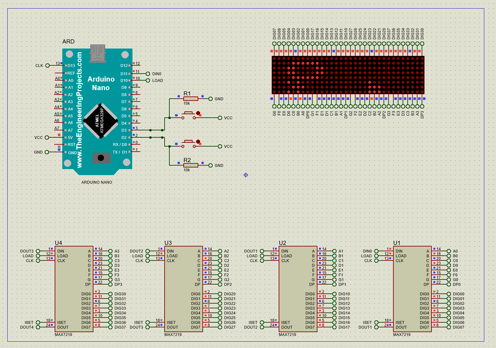

# Shallop

|   Cобытие   | Название | Категория | Сложность |
| :---------: | :------: | :-------: | :-------: |
| VKAСTF 2022 |  Ладья   |  Hardware  |  Легкая  |

## Описание

>Автор: [Rex]
>
>Плыве по морю лодъя
>Ей нарекли Сковарда
>О зло ветрам насад реста
>Дружина взыгра
>
>Грянет Валерман
>Насочихом адомант
>Егда Управливахом
>Мы всповадихомсiа...
>
>Доплывет ли наша ладья или потонет в пучине вод?)

[Yandex](https://disk.yandex.ru/d/xQdgs8s0Xgfssg)
[DropMeFiles](https://dropmefiles.com/mMy3i)

# Решение

Нам дан видос с тем как работает наша плата и прошивка для Arduino Nano. Конечно можно заняться реверсом прошивки в лоб, но лучше попробуем воссоздать проект и залить туда нашу начинку.

Как вариант можно воспользоваться Proteus. 

1) Для того, чтобы добавить в протеус Arduino Nano ищем соответствующую [либу](https://www.theengineeringprojects.com/2015/12/arduino-nano-library-proteus.html).
   Добавляем Arduino Nano в проект

2. Восстанавливаем логику платы

   

3. Загружаем нашу прошивку в настройках Arduino Nano

4. Проходим игру и получаем флаг

<video src="video.mkv"></video>

### Флаг
```
vka{SP4C3_R4C3R}
```

