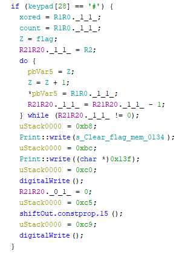
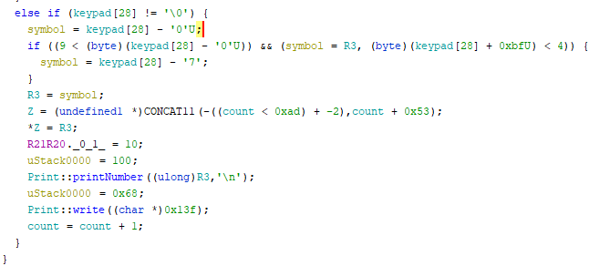
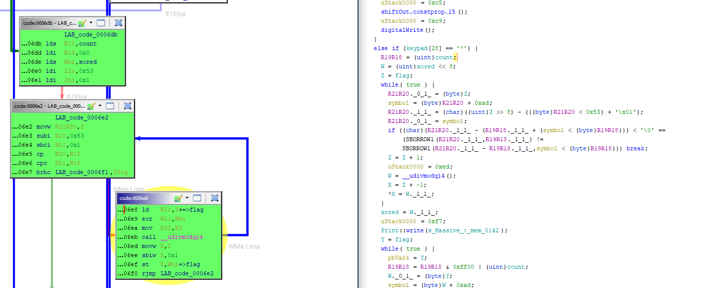
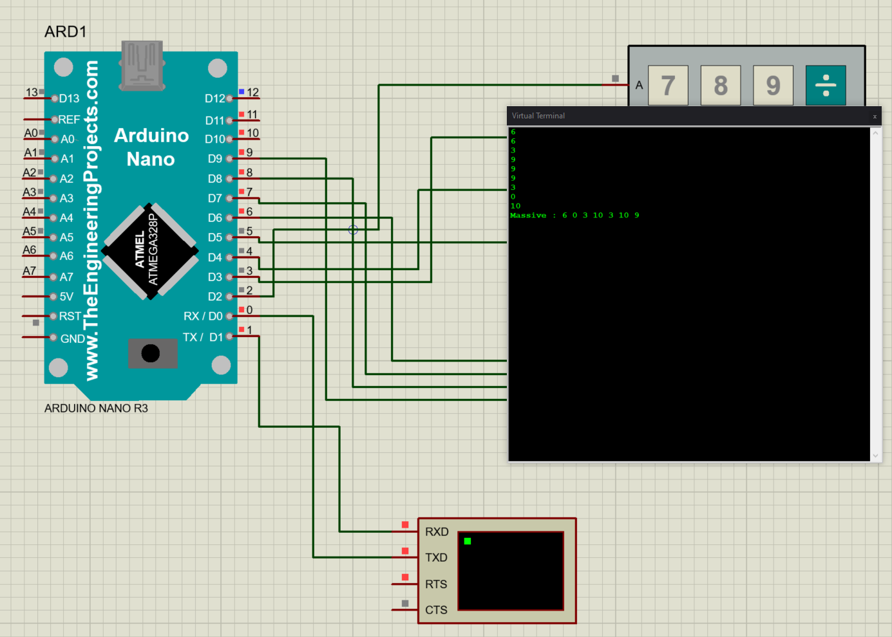
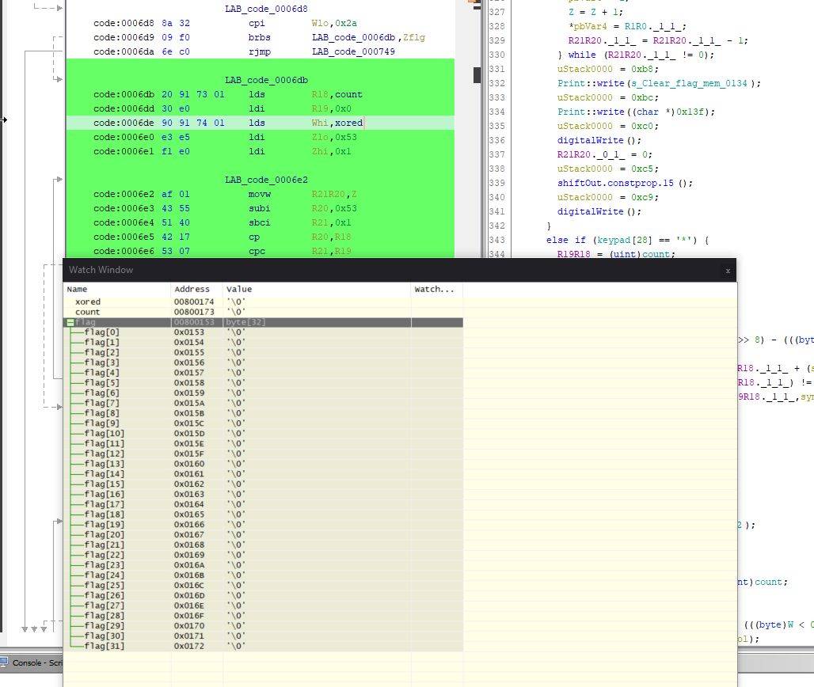

# Magic Encoder

|   Cобытие   |   Название    | Категория | Сложность |
| :---------: | :-----------: | :-------: | :-------: |
| VKAСTF 2022 | Тропинка тернистая | Железяки  |  Средняя  |

## Описание

>Автор: [Rex]
>
>Поздно ли, рано ли
>
>Отыскать тропинку другую,
>
>Чтоб из чужой земли
>
>Возвратиться в землю родную

[Yandex](https://disk.yandex.ru/d/3wALt3-4I1Y_uQ)
[DropMeFiles](https://dropmefiles.com/e0zMx)

# Решение

Из того, что нам дано:

1) Arduino Nano (чип Atmega328p)
2) 8-битовый регистр сдвига SN74HC595N
3) Матричная клавиатура 4х4
4) Резисторы и светодиоды
5) Прошивка в формате ELF

Можно загрузить и в IDA, но мне хочется посмотреть декомпиль нашего кода. Ищем main, и смотрим, что внутри.

Видим, что нажатие решетки '#' очищает память в которой хранится флаг



Заметим, что в коде встречается вывод в консоль, возможно нам это пригодится в будущем.

Запись комбинации вводимой с клавиатуры (проверка ненулевого значения keypad)



Получаем истинное значение, вводимое с матричной клавиатуры 


```c++
symbol = keypad[28] - '0';
symbol = keypad[28] - '7';
```

'0' -> 0

'1' -> 1

'A'->10

После записи значения, инкрементируется индекс массива флага

Итак, что же нам идет на вывод контактов, когда мы нажимаем '*' ?



Может пора перейти к отладке?)

Тут нам на выручку снова приходит Proteus. В первом задании мы уже скачивали либы для Arduino Nano, теперь же достаточно хотя бы подсоединить к ардуинке простую матрицу из тех, что доступна в proteus и консоль вывода. Заливаем нашу прошивку и запускаем отладку



Если проверить вывод, то он будет совпадать с светодиодным (в двоичном представлении)



Можем даже перепроверить по какому адресу лежит флаг

Попробуем понять с чем ксорится наш ввод


Запустив пару тестов и смотря одним глазом на асм, видим, что xored изначально равен нулю, и в ходе работы меняется следующим образом

```C++
xored = xored ^ flag[i]
```

Теперь пишем небольшой скрипт и декодим наш изначальный ввод

```python
end = [\
0b0001,\
0b0001,\
0b1101,\
0b1001,\
0b1101,\
0b1101,\
0b0111,\
0b1010,\
0b1001,\
0b0001,\
0b1010,\
0b0000,\
0b0101,\
0b0111]

xored = 0
for i in range(14):
    for j in range(15):
        if j ^ xored == end[i]:
            print(hex(j))
            xored = (j^xored) % 14

```

# Флаг

```
vka{10c440ad38ba52}
```
