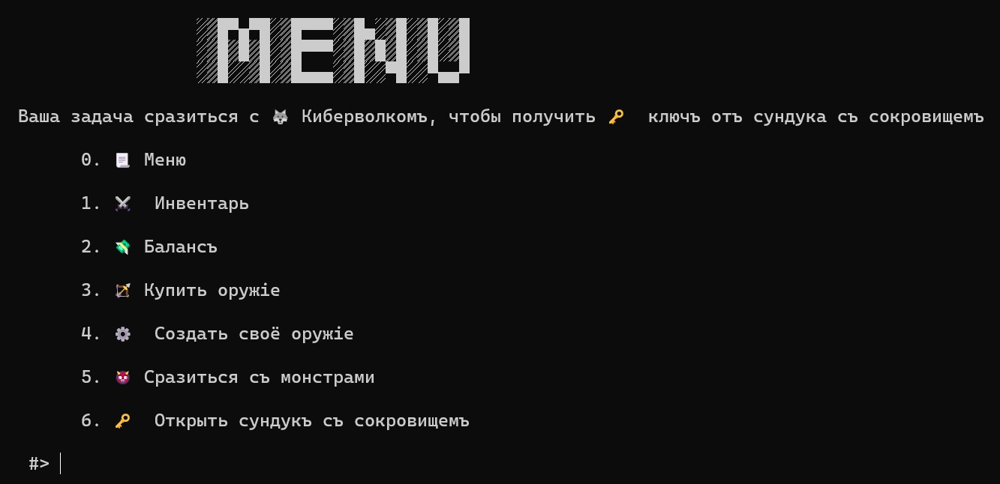
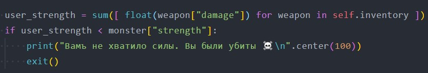
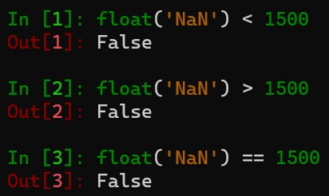

## CYBER TEEN WOLF

| Событие | Название | Категория | Сложность |
| :------ | ---- | ---- | ---- |
| VKACTF 2022 | CYBER TEEN WOLF | Python | Easy |

### Описание

> Автор: [ 𝕂𝕣𝕒𝕦𝕤𝕖 ]
>
> Мы очень много лет сражались со злом и методом проб и ошибок выяснили, что любого оборотня можно убить при помощи осинового кола, серебряного оружия, пепла из рябины, цветка растения омелы либо волчьего аконита. Но почему-то ни один из предложенных способов не помог на справиться с Киберволком. Помоги нам найти способ его одолеть!

>nc 176.118.164.39 65001

### Уязвимость

> [NaN Injection](https://blog.bitdiscovery.com/2021/12/python-nan-injection/)

### Решение


Задание представляет из себя мини-игру, в которой необходимо покупать оружие и сражаться с монстрами. Но, купив всё оружие и создав своё, невозможно одолеть Киберволка.

Уязвимость возникает в следующем участке кода



Если значение переменной равно `NaN`, то математические операции с этой переменной становятся непредсказуемыми



Таким образом, создав оружие с уроном `NaN`, мы обойдём проверку и сможем одолеть любого монстра

### Флаг

```
vka{py7h0n_n4n_1nj3c701n}
```