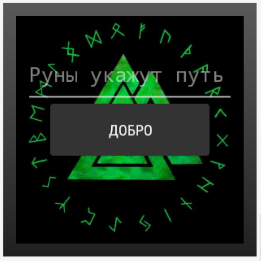
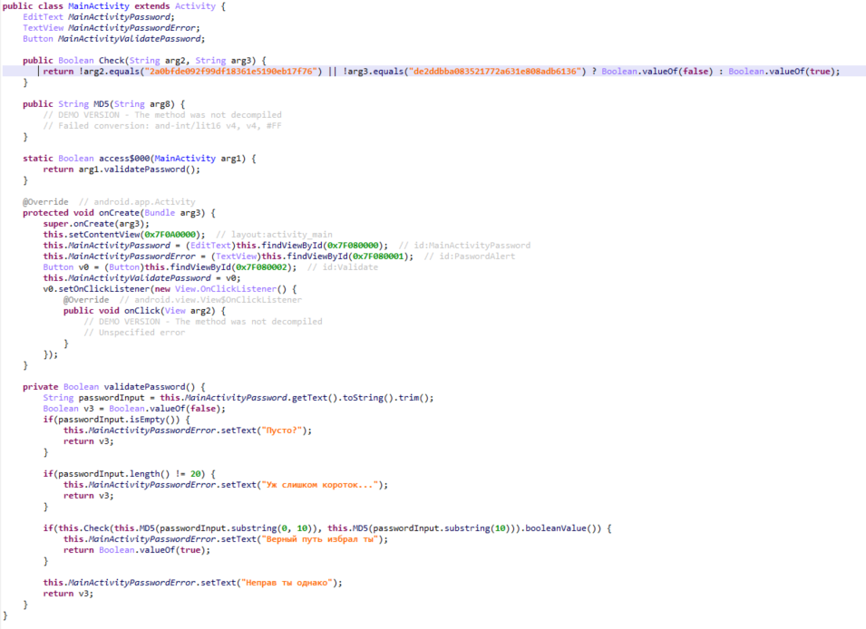
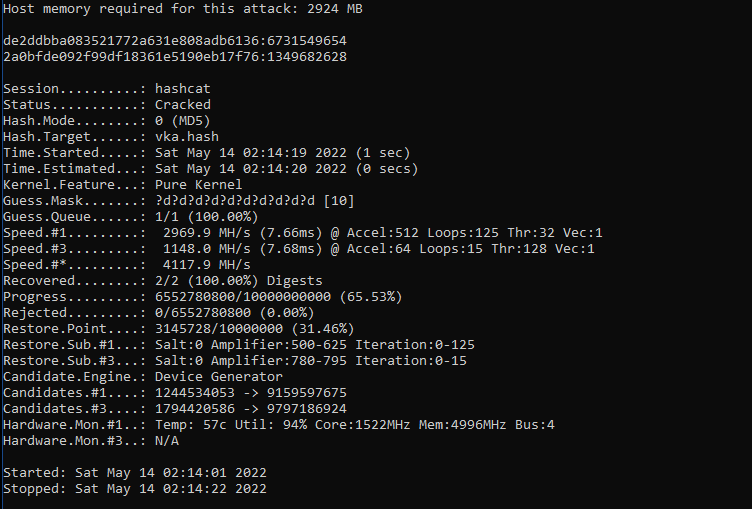

# Graph

|   Cобытие   | Название | Категория | Сложность |
| :---------: | :------: | :-------: | :-------: |
| VKACTF 2022 |  Руны укажут путь  |  Обратная разработка  |  Легкая  |

## Описание

>Автор: [Rex]
>
>Налево пойдешь - коня потеряешь,
>
>Направо пойдешь - жизнь отдашь,
>
>Прямо пойдешь - жив будешь, да себя позабудешь
>
>И все бы хорошо, да только тут не право или лево,
>
>А пинкод заморский...

# Решение

Итак, нам дан apk-ник для смарт-часов



Можно сэмулировать, можно и в статике посмотреть. Нам предлагается ввести пароль


Курим код. Здесь подойдет лучше всего JEB



Видим, что нам нужно ввести пароль длинной 20 цифр. После чего пароль разбивается на 2 части и сравнивается с имеющимися хешами. Брутим хешики и получаем цифровой пинкод



```
2a0bfde092f99df18361e5190eb17f76:1349682628
de2ddbba083521772a631e808adb6136:6731549654
```

### Флаг

Заворачиваем пароль и сдаем флаг
```
vka{13496826286731549654}
```