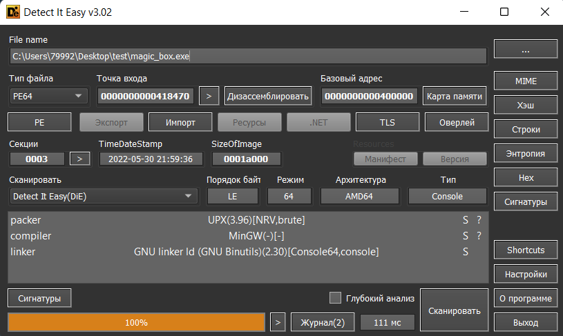

# Graph

|   Cобытие   | Название | Категория | Сложность |
| :---------: | :------: | :-------: | :-------: |
| VKACTF 2022 |  То самое то, не знаю что  |  Reverse  |  Средний  |

## Описание

>Автор: [Prokuror]
>
>Эти женщины - просто нечто... Марьюшка моя выдала недавно: пойди туда - не знаю куда, принеси то - не знаю что. Ну а я же не покемон: полез сразу в даркнет, нашел вот это. Две недели уже с ней сидим, раскуриваем...

# Решение

Нам дан .exe файл, но при выполнении ничего особого не происходит. Закидываем в Detect It Easy:


Файл упакован upx, распоковываем:
```
upx.exe -d magic_box.exe
```
Закинем в Иду. По функции `MapVirtualKeyExA` в функции `save` понимаем, что мы имеем дело с кейлоггером. Находим условие, связанное со строками **Windows PowerShell** и **bqylloztyxjaavlrszuzoaqh**, вторая строка перворачивается:

```cpp
qmemcpy(Buf2, "bqylloztyxjaavlrszuzoaqh", 24);
v40 = *(_QWORD *)String;
*((_BYTE *)Buf2 + *(_QWORD *)String) = 0;
v9 = (char *)Buf2;
if ( (char *)Buf2 + v40 != Buf2 )
{
  v10 = (char *)Buf2 + v40 - 1;
  if ( Buf2 < v10 )
  {
    do
    {
      v11 = *v9;
      *v9++ = *v10--;
      v10[1] = v11;
    }
    while ( v9 < v10 );
  }
}
```
В итоге получаем строку: **hqaozuzsrlvaajxytzollyqb**

Запускаем **Windows PowerShell**, записываем получившуюся строку. В файле `secret.txt` появляется флаг.

### Флаг

```
vka{MA6iCi5reAl}
```
