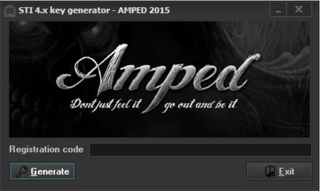
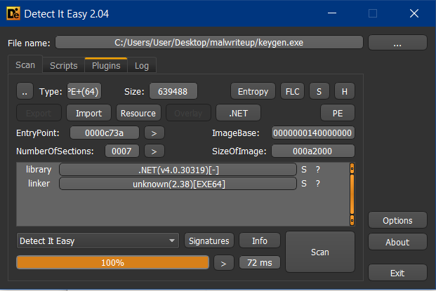
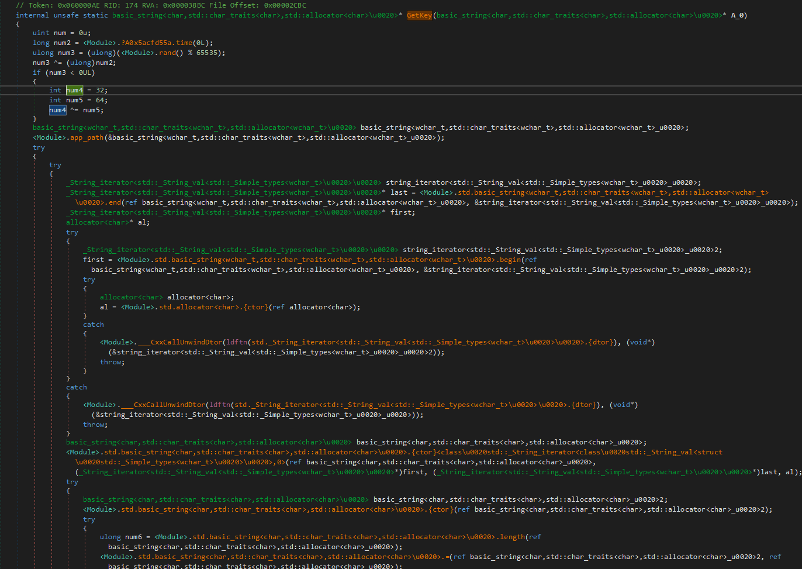
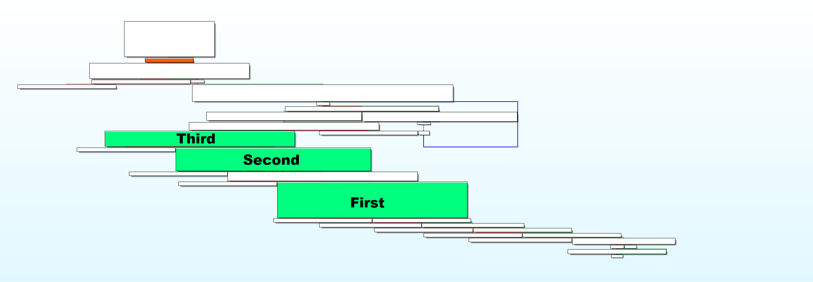
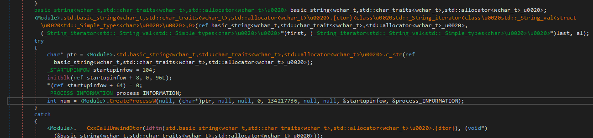
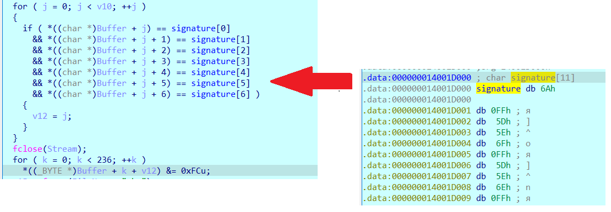

# Malware

|   Cобытие   | Название | Категория | Сложность |
| :---------: | :------: | :-------: | :-------: |
| VKACTF 2022 |  Malware  |  Обратная разработка  |  Сложная  |

## Описание

>Автор: [Rex]
>
>Нависла над Землей-матушкой беда,
Что ни день, то вирусы проклятые,
Коли будешь непослушен и тебя настигнет,
Вот так и приключилось с нашим Ванькой дураком,
Что без антивирусной защиты жил...
Помоги ему вирус найти,
Знаем, что Ванька наш качал много чего

[Yandex](https://disk.yandex.ru/d/BGY_AggxabHA4A)
[DropMeFiles](https://dropmefiles.com/s9E1B)
# Решение

### keygen

Гуляем по загрузкам, смотрим откуда и что скачано, сравниваем с исходными файлами. Даже визуально выглядит подозрительно **keygen.exe** для Understand

Наш исполняемый файл


Оригинальный



Если будем запускать бинарь, то на мгновение заметим всплывающую консоль, надо бы посмотреть, что это такое...



Пихаем в dnSpy. Из крипты кстати можно заметить ARC4. Также невооруженным глазом видно IsDebuggerPresent.

Смотрим порядок вызова функций: по нажатии кнопки "**Generate**" вызывается GetKey



Последовательно запускаются три потока (Third, Second, First)



В конце их встречают **WaitForSingleObject** и **CloseHandle**, а также функция с именем **WaitForS1ngleObject**. Рубрика найди 10 отличий...ну или хотя бы одно)


На вход **WaitForS1ngleObject** принимает строку cmder.

По ходу выполнения GetKey, cmder принимает значение

**appfolder + "\libs\QtGui.dll" + путь до keygen**

Затем вызывается QtGui.dll



#### Потоки

**First** в случае наличия отладчика меняет someKey на **an0th3r_k3y** и вызывет Magic. Magic - реализует шифрование C:\\Users\\User\\Desktop\\flag.txt (да-да, прям так и захардкожено)

**Second** переходит к выполнению функции Win32_FindObj.

**Third** не нужен) Ничего полезного он не делает, только отвлекает от выполнения основного потока.

### QtGui.dll

Загружаем QtGui.dll в иду, отлаживаем, видим, что по прошествии 10 секунд исполняемый файл *перезаписывает LSB байты* после того, как встречает сигнатуру `6AFF5d5e6fff5d5e6eff`



Если мы упустили этот момент, то будем и дальше реверсить ненужный код, если нет, то расшифровываем код, спрятанный в ресурсах исполняемого файла и идем на качать полезную нагрузку на http://es.vkactf.ru/magic.exe

### magic.exe

С первого взгяда видно, что наш криптор нацелен на только <u>C:\\Users\\User\\Desktop\\flag.txt</u>

Курим, понимаем что это RC4, в котором ключ - unix time преобразованный в hex. Учитывая, что старт выставить надо на 09.06.2022, перебираем временной промежуток который нам дан и получаем флаг


### Флаг

```
vka{Cyb3r_t4r4k4n1_V0t_t4k13_d3L4}
```

