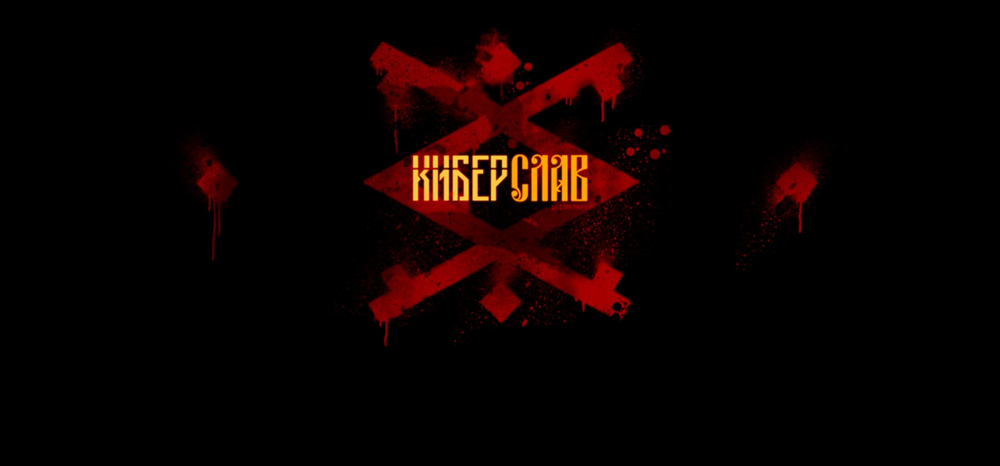
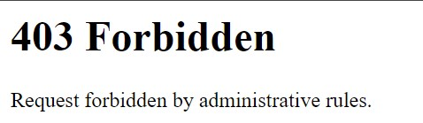
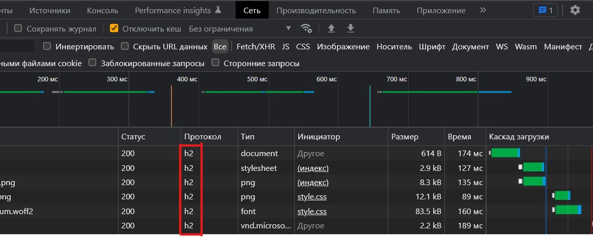

## Сага о Киберславе. HTTP часть 2

| Событие | Название | Категория | Сложность |
| :------ | ---- | ---- | ---- |
| VKACTF 2022 | Сага о Киберславе. HTTP часть 2 | Web | Easy |

### Описание

> Автор: [ 𝕂𝕣𝕒𝕦𝕤𝕖 ]
>
> В сеть были слиты исходные коды сайта Киберслава. Узнайте, что они скрывают!

### Уязвимость

> [Request Smuggling Via HTTP/2 Cleartext (h2c)](https://bishopfox.com/blog/h2c-smuggling-request)

### Решение


Функционал сайта минимален. На главной странице отсутствует какое-либо взаимодействие с пользователем. Перейдя по пути `/flag` веб приложение должно выдать флаг, но веб-сервер `HAProxy` запрещает нам это сделать, блокируя любой запрос по данному пути.



В консоли разработчика в разделе `Сеть` можно заметить, что приложение общается по протоколу `HTTP/2`



Уязвимость заключается в том, что веб-сервер `HAProxy` **по-умолчанию** пересылает заголовки `Upgrade` и `Connection`, что позволяет провести атаку `h2c Smuggling`

На github можно найти публичный [эксплойт](https://github.com/BishopFox/h2csmuggler/blob/master/h2csmuggler.py), реализующий данную атаку.

Экслойту необходимо передать адрес прокси-сервера и путь, доступ к которому необходимо получить. Запускаем эксплойт и получаем флажок

```bash
python3 h2csmuggler.py -x https://PROXY http://127.0.0.1/flag
```

### Непредполагаемое решение

```
https://185.193.143.214//flag
```

**Флаг:**

> vka{h2c_http_smuggling}
